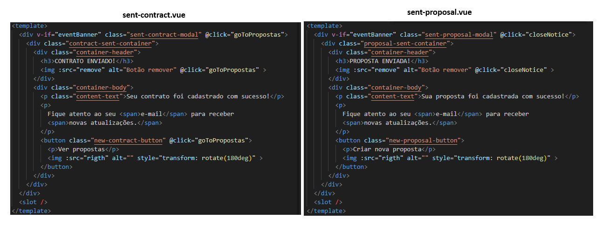
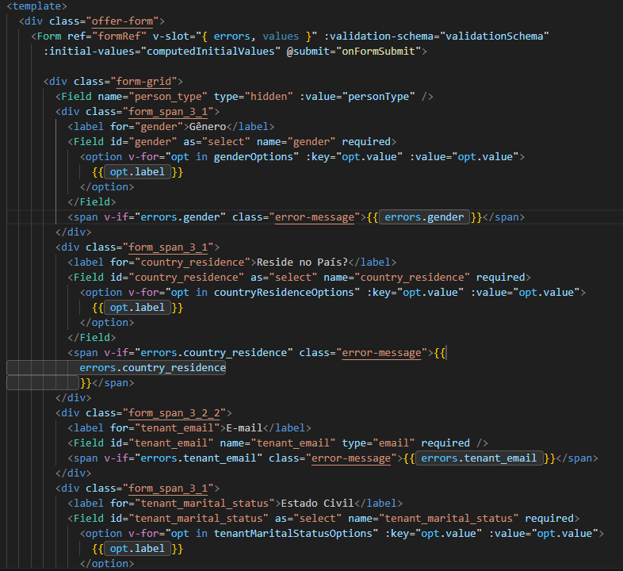

# Erros e Ajustes Necessários no Atomic Design

## **1. Requisições nos componentes**

**Problema:** Atualmente algumas requisições à API estão sendo feitas diretamente dentro de componentes. Isso fere o princípio de separação de responsabilidades do Atomic Design.

**Impacto:**

- Torna os componentes menos reutilizáveis, já que ficam acoplados a regras de negócio.
- Dificulta testes, manutenção e evolução do projeto.
- Quebra a hierarquia de responsabilidades esperada.

**Correção Recomendada:**

- Centralizar todas as requisições na Página.
- A Página deve buscar/enviar dados para a API e repassar os resultados via props para o Template e componentes filhos.
- Os componentes (organismos, moléculas e átomos) devem apenas exibir dados recebidos ou disparar eventos que a Página irá tratar.

Componentes Identificados com Requisições:

**moleculas:**

- `evolution-history.vue`
- `fire-insurance-card.vue`
- `policy-link.vue`

**templates:**

- `contract.vue`
- `fire-insurance.vue`

**Prioridade:** Alta — afeta diretamente a reutilização e manutenibilidade dos componentes.

## **2.** **Ajustes Necessários para Conformidade com o Atomic Design**

&lt;u>***Importante:***&lt;/u>&lt;u> &lt;/u>Todos os componentes devem ser refatorados conforme os princípios do **Atomic Design**. Nesta documentação estamos apontando casos de **componentes duplicados**. Sempre que um átomo envolver mais de um elemento (por exemplo, um `input` com `label` e `errorMessage`), deve-se avaliar corretamente a hierarquia e construir o componente na camada adequada, seguindo a documentação de padrões definida.

Link para duvidas do atomic design: [Introdução ao Atomic D... | Ajuda DigitalSys](https://ajuda.digitalsys.com.br/books/manual-do-desenvolvedor/page/introducao-ao-atomic-design-no-hsoares)

##### **2.1 Duplicação de campos de input**

**Problema:**  
Atualmente existem dois componentes responsáveis por renderizar campos de input com label, spinner e mensagem de erro. Apesar de possuírem praticamente a mesma estrutura, eles apresentam pequenas diferenças na implementação (ex.: suporte ao `v-model`). Essa duplicação fere o princípio de **reutilização e consistência** esperado pelo Atomic Design.

**Impacto:**

- Duplicação de código aumenta o esforço de manutenção.
- Alterações futuras precisam ser replicadas em ambos os componentes.
- Risco de inconsistência de comportamento entre os dois.

**Correção Recomendada:**

- Criar **um único componente unificado** (`FieldInput.vue`) que atenda tanto ao uso simples quanto ao uso com `v-model`.
- Padronizar para que todos os campos utilizem `modelValue` e `update:modelValue`, mantendo compatibilidade com o Vue.
- Garantir que estilos e comportamentos (label, required, spinner, error message) sejam centralizados e consistentes.
- Substituir gradualmente os componentes duplicados pelo novo componente unificado.

**Componentes Identificados com Duplicação:**

- `atoms/input-form.vue`
- `atoms/input-form-fire-coverage.vue`
- `atoms/input-search.vue`

**Prioridade:**  
Alta — impacta diretamente na manutenibilidade, consistência e evolução do design system.

##### **2.2 Duplicação de Componentes de Login**

**Problema:**  
Atualmente existem dois componentes distintos para lidar com inputs de login:

- Um componente para campos de texto simples (`input-login`).
- Um componente específico para senha com botão de exibir/ocultar (`input-password`).

Ambos possuem a mesma base estrutural (label, input, estilização e binding com `v-model`), mas estão duplicados em arquivos diferentes, o que gera redundância de código e manutenção desnecessária.

**Impacto:**

- Duplicação de código aumenta esforço de manutenção.
- Alterações de estilo, acessibilidade ou comportamento precisam ser replicadas em ambos os componentes.
- Risco de inconsistência visual ou funcional entre os dois.

**Correção Recomendada:**

- Criar um **único componente unificado (**`&lt;strong class="editor-theme-bold editor-theme-code">InputLogin.vue&lt;/strong>`**)** que consiga atender tanto inputs simples quanto inputs de senha.
- Utilizar a prop `type` para decidir o comportamento:
    - `type !== 'password'` → renderiza input padrão.
    - `type === 'password'` → renderiza input com botão para alternar visibilidade.
- Manter suporte ao `v-model` (`modelValue` + `update:modelValue`) para garantir compatibilidade com formulários.
- Centralizar estilos e comportamento para evitar duplicações.

&lt;u>**Importante:**&lt;/u>&lt;u> Definir os valores aceitos para &lt;/u>&lt;u>`type`&lt;/u>&lt;u> dentro de um&lt;/u>&lt;u> **ENUM (**&lt;/u>&lt;u>**`&lt;strong class="editor-theme-bold editor-theme-code editor-theme-underline">INPUT_TYPES&lt;/strong>`**&lt;/u>&lt;u>**)**&lt;/u>&lt;u>, garantindo padronização no uso.&lt;/u>

**Componentes Identificados com Duplicação:**

- `atoms/input-login.vue`
- `atoms/input-password.vue`

**Prioridade:**  
Média-Alta — impacta diretamente a consistência do design system e a manutenibilidade futura.

##### **2.4 Duplicação de card tenants**

**Problema:**  
Atualmente existem dois componentes distintos para representar cartões de tenants (inquilinos/segurados). Apesar de compartilharem praticamente toda a estrutura (estilo, comportamento de seleção, botão de remoção e exibição do nome), eles diferem apenas em pequenos detalhes de texto e rótulos (“Inquilino” x “Segurado”). Isso gera código duplicado e fere o princípio de reutilização esperado pelo Atomic Design.

**Impacto:**

- Aumento do esforço de manutenção, já que qualquer alteração precisa ser replicada em ambos os componentes.
- Risco de inconsistência visual ou funcional (ex.: diferença em estilos, textos ou eventos).
- Redução na clareza do design system, já que dois componentes diferentes cumprem a mesma função.

**Correção Recomendada:**

- Criar um único componente unificado (`TenantCard.vue`) que cubra os diferentes cenários de exibição.
- Incluir uma prop `role` para diferenciar o texto exibido no card (`Inquilino`, `Segurado`, `Sócio`).
- Manter a lógica de clique e remoção no mesmo componente, evitando duplicidade.
- Substituir gradualmente os dois componentes duplicados pelo novo componente unificado.

&lt;u>**Importante:** &lt;/u>&lt;u>Centralizar os valores aceitos em um &lt;/u>&lt;u>**ENUM (**&lt;/u>&lt;u>**`&lt;strong class="editor-theme-bold editor-theme-code editor-theme-underline">TENANT_ROLES&lt;/strong>`**&lt;/u>&lt;u>**)**&lt;/u>&lt;u> para garantir padronização e prevenir uso incorreto.&lt;/u>

**Componentes Identificados com Duplicação:**

- `atoms/card-tenants.vue`
- `atoms/card-tenants-fire.vue`

**Prioridade:**  
Média — afeta diretamente a consistência visual e a manutenibilidade futura, mas não bloqueia a evolução imediata de outras funcionalidades.

##### **2.5 Duplicação de botões**

**Problema:**  
Atualmente existem múltiplos componentes (ou implementações isoladas) para botões, variando apenas em cor, ícone (esquerda/direita) ou texto. Isso gera duplicação de código e dificulta a manutenção e evolução do design system, além de comprometer a consistência visual.

**Impacto:**

- Aumento do esforço de manutenção, pois qualquer ajuste de estilo precisa ser replicado em diferentes botões.
- Maior risco de inconsistência visual (diferenças de cor, padding, espaçamento ou tipografia).
- Dificulta a padronização de acessibilidade (aria-labels, estados disabled, foco).

**Correção Recomendada:**

- Criar um único componente unificado que atenda a todos os cenários de botão.
- O componente deve receber **props configuráveis**, como:
- `variant` → define o padrão de cor (ex.: `"primary"`, `"secondary"`, `"success"`, `"danger"`).
- `icon` → caminho para o ícone.
- `iconPosition` → define posição do ícone (`"left"` ou `"right"`).
- `disabled` → estado desabilitado.
- `fullWidth` → para botões que ocupam a largura total.

**Componentes/Implementações Identificados com Duplicação:**

- Botão **Entrar**
- Botão **Começar a proposta**
- Botão **Finalizar**
- Botão **Enviar proposta**
- Botões de navegação (**Voltar / Próximo**)
- Botões de ação rápida (**Pesquisar / Limpar**)

&lt;u>**Importante:**&lt;/u>&lt;u> Podem existir mais botões com o mesmo estilo dos citados a cima&lt;/u>

**Prioridade:**  
Alta — impacta diretamente a consistência visual, a manutenibilidade e a escalabilidade do design system.

##### **2.6 Duplicação de Modais de Confirmação**

**Problema:**  
Existem múltiplos componentes quase idênticos para confirmação de envio (proposta/contrato). Eles repetem estrutura, HTML e lógica, alterando apenas alguns textos, classes e handlers.

**Impacto:**

- Duplicação de código (mais difícil de manter).
- Se for necessário mudar layout, tipografia ou acessibilidade, a alteração deve ser feita em todos os lugares.
- Crescimento desnecessário da base de componentes.

**Correção Recomendada:**  
Unificar em **um único componente** `&lt;strong class="editor-theme-bold editor-theme-code">ConfirmationModal.vue&lt;/strong>`**, parametrizado por `props`:

- `title` → título principal (`PROPOSTA ENVIADA!`, `CONTRATO ENVIADO!`).
- `message` → mensagem principal de sucesso.
- `buttonText` → texto do botão de ação.
- `onClose` → função a ser chamada ao fechar (ou `emit("close")`).
- `onAction` → função a ser chamada ao clicar no botão principal.
- `variant` (opcional) → para aplicar estilos diferentes se necessário (`"proposal"`, `"contract"`).

**Componentes Identificados com Duplicação:**

- `atoms/sent-contract.vue`
- `atoms/sent-proposal.vue`

**Prioridade:**  
Média/Alta — reduz duplicação de código e facilita a criação de novos modais de confirmação no futuro

##### **2.7 Duplicação de Selects**

**Problema:**  
Existem múltiplos componentes `&lt;select>` praticamente idênticos, variando apenas no label inicial e no conjunto de opções.

**Impacto:**

- Duplicação de código CSS e HTML.
- Alterações de estilo ou comportamento precisam ser replicadas em todos os arquivos.
- Maior dificuldade de manutenção e evolução.

**Correção Recomendada:**  
Criar um **componente único** `&lt;strong class="editor-theme-bold editor-theme-code">BaseSelect.vue&lt;/strong>`** (apenas uma sugestão de nome) que recebe via `props`:

- `modelValue` → valor selecionado (com `v-model`).
- `placeholder` → primeira opção exibida (ex.: `"Status"`, `"Finalidade"`, `"Produto"`).
- `options` → Array de objetos `{ label, value }`.
- `width`, `height` (opcional) → caso precise customizar dimensões.

**Componentes Identificados com Duplicação:**

- `atoms/select-product.vue`
- `atoms/select-purpose.vue`
- `atoms/select-status.vue`
- `atoms/select.vue`
- `atoms/select-search-type.vue`

&lt;u>**Importante**&lt;/u>**:** O componente `atoms/select.vue` está sendo classificado como um átomo, mas, na prática, ele não deveria estar nessa camada. Isso porque ele não é apenas um `&lt;select>` isolado (átomo), e sim a composição de elementos:

- um componente de **select** (átomo)
- uma **label** (átomo)

Portanto, de acordo com os princípios do Atomic Design, esse componente deve ser tratado como uma **molécula**.  
A recomendação é que ele seja ajustado para utilizar o novo componente atômico `BaseSelect.vue`, garantindo assim consistência na hierarquia e reutilização correta dos átomos.

**Prioridade:**  
Alta — reduz 5 componentes para apenas um, melhora consistência e facilita manutenção.

##### **2.8 Construção de formulario**

**Problema:**  
Na construção do formulário `molecules/form-contract-offer.vue`, foram utilizados diretamente os componentes **Field** do `vee-validate`. Isso cria inconsistência com a abordagem definida no design system.

**Impacto:**

- O formulário deixa de seguir os padrões estabelecidos no projeto.
- Dificulta a reutilização e padronização dos componentes.
- Aumenta a chance de divergências visuais e funcionais entre diferentes formulários.

**Correção Recomendada:**

- Substituir o uso direto de **Field** pelos novos **Selects padronizados** criados no item **2.7**.
- Garantir que todos os inputs e selects utilizados nos formulários sigam a hierarquia do Atomic Design.
- Manter a validação integrada ao `vee-validate`, mas acoplada aos componentes do design system.

**Prioridade:**  
Média — impacta a consistência e padronização dos formulários no sistema.

##### **2.9** **Duplicação de Componentes de Tenants**

**Problema:**  
Atualmente existem dois componentes quase idênticos para lidar com a listagem e adição de tenants:

- `molecules/tenants.vue`
- `molecules/tenants-fire.vue`

A estrutura e regras de negócio são praticamente as mesmas, variando apenas em detalhes de nomenclatura (`Inquilino`/`Segurado`), imports (`card-tenants.vue` / `card-tenants-fire.vue`) e utilitários específicos (`formSection` / `formSectionInsuranceFire`). Essa duplicação gera redundância e complexidade desnecessária.

**Impacto:**

- Duplicação de código aumenta esforço de manutenção.
- Alterações de layout, regras ou validação precisam ser replicadas manualmente em ambos.
- Risco de inconsistência entre os fluxos de cadastro.

**Correção Recomendada:**

- Criar um único componente unificado que receba via **props** os elementos variáveis:
    - `labelCard`
    - Componente de Card (`CardTenants` ou `CardTenantsFire`).
    - Função `useFormSections` específica.
- Centralizar toda a lógica de adição, exclusão, banners e botões em um único lugar.
- Substituir gradualmente os dois componentes duplicados pelo novo componente genérico.

**Componentes Identificados com Duplicação:**

- `tenants.vue`
- `tenants-fire.vue`

**Prioridade:**  
Média — duplicação extensa com impacto direto na manutenibilidade.

## **3.** **Componentes não utilizados**

**Problema:** Atualmente, há componentes no projeto que não estão sendo utilizados. Caso não exista previsão de uso futuro, esses componentes devem ser removidos a fim de manter o projeto mais limpo, organizado e fácil de manter.

São esses: 

- `molecules/side-bar.vue`
- `atoms/logo.vue`
- `molecules/form-locador.vue`
- `organisms/events-tab.vue`
- `organisms/payment-tab.vue`

## **4.** **Componentes com problema de hierarquia**

Alguns componentes não estão alinhados com a hierarquia definida pelo **Atomic Design**. Essa inconsistência dificulta a manutenção, a padronização e a correta reutilização dentro do projeto.

**Importante:** Parte dos componentes listados abaixo pode já estar contemplada nas correções sugeridas na seção **2. Ajustes Necessários para Conformidade com o Atomic Design**. A hierarquia final deve ser revisada após a refatoração geral.

**Identificação de Problemas:**

- **Átomos (Atoms):**
    - `button-login.vue`
- **Moléculas (Molecules):**
    - `pagination.vue`
    - `payment-selector.vue`
    - `policy-link.vue`
    - `proposal-details.vue`
    - `purchase-modal.vue`
    - `offers-card.vue`
    - `offer-summary.vue`
    - `offer-details-card.vue`
    - `insurance-card.vue`
    - `installment-selector.vue`
    - `fire-insurance-card.vue`
    - `evolution-history.vue`
- **Organismos (Organisms):**
    - `company-tab.vue`
    - `contract-tab.vue`
    - `coverages-tab.vue`
    - `tenants-tab.vue`

**Correção Recomendada:**

- Revisar a composição de cada componente e reclassificá-los de acordo com sua responsabilidade no sistema:
    - Átomos → Elementos básicos e indivisíveis.
    - Moléculas → Combinações simples de átomos.
    - Organismos → Conjuntos mais complexos, geralmente com múltiplas moléculas e/ou lógica de negócio.
    - Templates → Estrutura de layout que organiza organismos sem conter lógica de negócio.
- Criar documentação clara para orientar futuros desenvolvimentos e evitar que novos componentes sejam criados com hierarquia incorreta.

**Prioridade:**  
Média-Alta — Impacta diretamente a clareza da arquitetura do design system e a escalabilidade do projeto.

### **5. Pages com Construção de HTML fora do Atomic Design**

**Problema:**  
Algumas páginas estão sendo construídas com **HTML e estilização diretamente dentro do componente de página**, em vez de compor a interface reutilizando átomos, moléculas, organismos e templates definidos no design system.

Um exemplo é a **`&lt;strong class="editor-theme-bold editor-theme-code">pages/reset-password.vue&lt;/strong>`**, onde toda a estrutura de layout, containers, estilização e até elementos como `img`, `divs` e `form` estão definidos diretamente no arquivo da página.

Esse tipo de implementação **fere o princípio de separação de responsabilidades do Atomic Design**, pois:

- Páginas devem apenas **orquestrar templates e organismos**, sem conter lógica de layout detalhada ou marcação extensiva.
- A repetição de HTML e CSS diretamente nas páginas dificulta a reutilização de estilos e componentes.
- Torna o projeto menos escalável e mais difícil de manter.

**Impacto:**

- Duplicação de código de layout entre diferentes páginas.
- Quebra de consistência visual, já que cada página pode implementar estilos próprios.
- Dificuldade de evoluir ou aplicar mudanças globais de design.

**Páginas que precisam de correção:**

- `contratar`
- `pagamento`
- `password-reset-request`
- `produtos`
- `proposal-info`
- `propostas`
- `propostas-grupo`
- `reset-password`
- `sobr`

**Correção Recomendada:**

- Extrair o layout e elementos visuais da página para componentes apropriados:
    - Criar um **Template** que centralize o layout comum (logo, container centralizado, estilos responsivos, etc.).
    - Utilizar **moléculas e organismos** já existentes no lugar de HTML cru.
    - Garantir que a **page** apenas orquestre:
        - Importa o Template.
        - Passa props e dados necessários.
        - Lida com a lógica de submissão e comunicação com a API.

**Prioridade:**  
Alta — impacta diretamente na arquitetura do projeto, manutenção futura e escalabilidade do design system.

### **6. Padronização de Textos com Utils**

**Problema:**  
Atualmente alguns textos estão sendo escritos diretamente dentro dos componentes, como no exemplo abaixo:

Isso fere o princípio de centralização de mensagens e dificulta a padronização.

Outros exemplos que precisam seguir a mesma correção:

**Impacto:**

- Risco de textos diferentes para a mesma situação.
- Dificuldade de internacionalização (i18n).
- Aumento de duplicação de código.

**Correção Recomendada:**

- Centralizar todos os textos em **utils** (ou constantes, enums e objetos de mensagens).
- Utilizar sempre **enums e constantes** definidas, evitando textos hardcoded nos componentes.
- Garantir que qualquer ajuste futuro em mensagens seja feito em apenas um ponto.

***Importante:***  
&lt;u>**Esse problema ocorre em diversos componentes do sistema e deve ser corrigido gradualmente, em conjunto com os demais ajustes já descritos nos pontos anteriores.**&lt;/u>