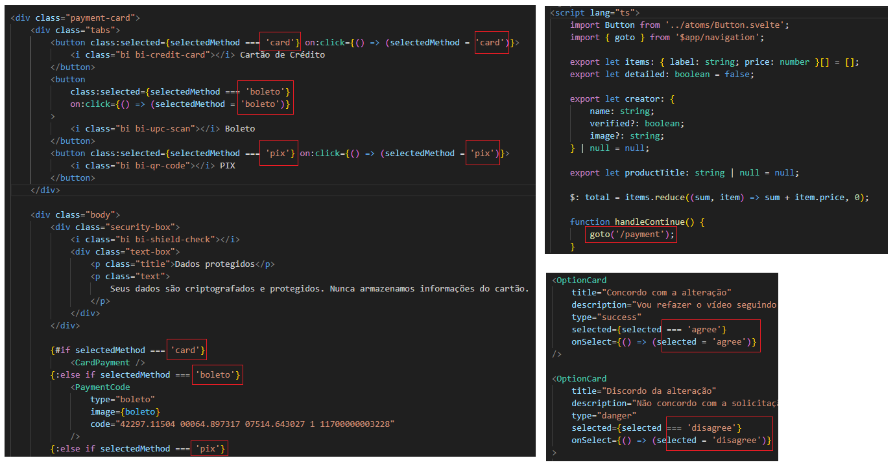

# Erros e Ajustes Front End

## **1.**  **Atomic Design**

#### **1.1 Tipografia - tratar tipografia como Átomo**

É essencial que a tipografia seja tratada como **átomos** dentro do nosso sistema, a fim de garantir **consistência, organização e escalabilidade** no projeto.

Atualmente, a tipografia **não está estruturada dessa forma**: variações de títulos, parágrafos e legendas são aplicadas diretamente em componentes ou páginas. Isso resulta em **duplicação de código, inconsistências visuais** e maior esforço de **manutenção**.

No contexto do **Atomic Design**, cada unidade mínima da interface deve ser considerada um átomo. Para a tipografia, isso significa que **cada variação de texto** — título, subtítulo, parágrafo, legenda, link etc. — deve ser representada por um **componente atômico reutilizável**.

Motivos:

- **Consistência visual**: garante que todos os títulos, descrições e legendas tenham o mesmo estilo em todo o sistema.
- **Escalabilidade**: se precisar mudar a fonte ou cor de um estilo, basta alterar no átomo.
- **Semântica**: organiza melhor o uso de elementos HTML (`&lt;h1>`, `&lt;h2>`, `` etc.).
- **Reutilização**: evita repetição de CSS.

Vamos ver um exemplo de como criar atomos de texto para o sistema

#### **1.2 Estrutura de exemplo para tipografia**

A seguir, apresentamos como pode ser organizada a árvore de arquivos de componentes de texto no projeto. É importante destacar que, sempre que surgir um novo estilo de título ou parágrafo no sistema, não devemos criar automaticamente um novo átomo. Antes disso, deve-se avaliar se um componente de texto existente (como um título ou parágrafo) pode ser estendido ou configurado para contemplar esse novo estilo.

##### **Heading (Títulos)**

A seguir, temos um exemplo de como um componente de título pode ser criado para oferecer flexibilidade e padronização. Esse componente representa títulos e subtítulos, permitindo o controle de **nível semântico** (`h1`, `h2`, `h3`), **tamanho da fonte**, **variação tipográfica** e **estilos especiais** (como o uso de gradiente).

Exemplo de uso: 

##### **Text (Corpo de texto)**

O componente de **corpo de texto** é utilizado para representar descrições, parágrafos, legendas e observações em geral. Ele garante consistência visual na aplicação e possibilita a configuração de propriedades como **tamanho da fonte**, **cor** e **hierarquia de uso**, mantendo o padrão tipográfico definido pelo sistema de design.

Exemplo de Uso:

##### **Combinações em níveis superiores**

- **Moléculas**: agrupam átomos de texto em blocos, ex.: `CardHeader` que combina `Heading` + `Text`.
- **Organismos**: usam moléculas e átomos de texto diretos, ex.: `LoginForm` com `Heading` para título e `Text` para legenda.

***Observação***: a imagem de logo exibida neste exemplo não foi transformada em um átomo, pois seu uso está restrito a este componente específico. No Atomic Design, apenas elementos que são* **reutilizáveis ou fazem parte da identidade global** *do sistema devem ser promovidos a átomos. Quando o elemento é de uso único, pode ser mantido diretamente no organismo ou página, evitando complexidade desnecessária.**

##### **Boas práticas**

Centralizar tokens de cor, fontes e tamanhos em **variáveis globais** (`:root { --font-size-md: 16px; }`).  
Sempre usar os **átomos de tipografia** — nunca escrever `...

` diretamente em organismos.  
Manter a semântica HTML correta (`Heading` gera `&lt;h1>`, `&lt;h2>`, etc.; `Text` gera ``).  
Revisar periodicamente se novos padrões de texto realmente precisam virar **átomos separados** ou podem ser variantes dos existentes.

## **2.** **Padrão de nomenclatura CSS (BEM)**

Atualmente, alguns componentes **não estão seguindo o padrão BEM** definido na nossa documentação de estilo. Além disso, **em algumas partes do projeto estamos utilizando Tailwind e em outras CSS padrão**, o que gera inconsistência na manutenção e dificulta a padronização do sistema de design.

Para mais detalhes, consulte a documentação oficial: [Desenvolvimento FrontE... | Ajuda DigitalSys](https://ajuda.digitalsys.com.br/books/manual-do-desenvolvedor/page/desenvolvimento-frontend-nextjs-e-nuxtjs) **topico:* **2. Padrão de Nomenclatura***

Podemos observar essas inconsistências nas imagens abaixo:

**Impactos da não utilização do BEM e da padronização inconsistente**

- Dificulta a **manutenção e leitura** do CSS.
- Aumenta a chance de **conflito de estilos** entre componentes.
- Complica a **reutilização e escalabilidade** do sistema de design.
- Cria inconsistência visual ao alternar entre Tailwind e CSS padrão.

**Correção recomendada**

1. **Seguir a estrutura de nomenclatura BEM** para todos os componentes novos:
    - **Bloco:** representa o componente principal, ex.: `card`
    - **Elemento:** parte do bloco, ex.: `card__title`
    - **Modificador:** variação ou estado, ex.: `card__title--highlighted`
2. **Revisar componentes existentes** e, quando possível, refatorar para aderir ao padrão BEM.
3. **Evitar estilos inline**: toda regra de estilo deve ser definida em classes, seguindo a convenção BEM.
4. **Padronizar o uso de CSS**: &lt;u>***Devemos remover o tailwind do projeto e utilizar somente css ou scss***&lt;/u>.
5. Garantir que todos os **novos desenvolvimentos sigam o padrão BEM** e a padronização de CSS, mantendo consistência em todo o sistema.

***Observação:** *o padrão BEM está definido na documentação interna do sistema de design e deve ser seguido obrigatoriamente para todos os componentes reutilizáveis.**

**Prioridade:**  
Alta — Impacta diretamente a clareza da arquitetura do design system e a escalabilidade do projeto.

## **3.** **Componentes com problema de hierarquia**

***obs: Em construção***

Alguns componentes não estão alinhados com a hierarquia definida pelo **Atomic Design**. Essa inconsistência dificulta a manutenção, a padronização e a correta reutilização dentro do projeto.

Além disso, foi observado que **muitos desses componentes são utilizados em apenas uma página ou contexto específico**. De acordo com o Atomic Design, componentes que não são reutilizáveis **não precisam ser promovidos a moléculas ou organismos**, podendo ser mantidos como **componentes locais** dentro da página (template) ou do organismo que os utiliza. Isso ajuda a **evitar complexidade desnecessária** e mantém a arquitetura do sistema mais clara.

**Identificação de Problemas:**

- **Átomos (Atoms):**
    - (Não foram identificados problemas nesta camada no momento).
- **Moléculas (Molecules):**
    - `AccountHeader.svelte`
    - `ContactTypeSelector.svelte`
    - `DescriptionCard.svelte`
    - `FaqList.svelte`
    - `FeatureBox.svelte`
    - `FeaturesContainer.svelte`
    - `GiftsList.svelte`
    - `HowWorksBox.svelte`
    - `LandingPageButtons.svelte`
    - `OptionCard.svelte`
    - `PaymentCode.svelte`
    - `PendingChanges.svelte`
    - `PhotoTypeSelector.svelte`
    - `ProfileAvailability.svelte`
    - `ProfileNotificationsConfig.svelte`
    - `ProfilePrivacyConfig.svelte`
    - `ProfileSpecialtiesLanguages.svelte`
    - `QualityGuarantee.svelte`
    - `RatingCard.svelte`
    - `ReportCategory.svelte`
    - `ReportInfoBox.svelte`
    - `SalesPerfomanceChart.svelte`
    - `ToneSelector.svelte`
    - `VideoPlayer.svelte`
- **Organismos (Organisms):**
    - `ContactForm.svelte`
    - `CaressSection.svelte`
    - `ComentarySection.svelte`
    - `GeneralCard.svelte`
    - `PriceCard.svelte`
    - `RakingCard.svelte`
    - `ReportForm.svelte`
    - `SendGiftModal.svelte`
    - `VideoRating.svelte`

**Correção Recomendada:**

- Revisar a composição de cada componente e reclassificá-los de acordo com sua responsabilidade no sistema:
    - Átomos → Elementos básicos e indivisíveis.
    - Moléculas → Combinações simples de átomos.
    - Organismos → Conjuntos mais complexos, geralmente com múltiplas moléculas e/ou lógica de negócio.
    - Templates → Estrutura de layout que organiza organismos sem conter lógica de negócio.
- Criar documentação clara para orientar futuros desenvolvimentos e evitar que novos componentes sejam criados com hierarquia incorreta.

**Prioridade:**  
Média-Alta — Impacta diretamente a clareza da arquitetura do design system e a escalabilidade do projeto.

## **4.** **Uso de Enums para valores fixos**

Atualmente, identificamos trechos de código em que valores fixos (strings, números ou identificadores) estão sendo usados diretamente dentro dos componentes.

- **Baixa legibilidade**: não fica claro o significado do valor.
- **Alta propensão a erros**: qualquer alteração exige busca e substituição manual em vários pontos.
- **Dificuldade de manutenção**: inconsistência entre usos do mesmo valor em locais diferentes.
- **Redução da escalabilidade**: valores duplicados aumentam o risco de divergências.

Podemos observar alguns exemplos nas imagens abaixo:

**Benefícios do uso de enums**

- **Centralização**: todos os valores ficam em um único local.
- **Autocompletar / tipagem**: maior suporte das IDEs e TypeScript.
- **Clareza semântica**: cada valor possui um nome significativo.
- **Facilidade de alteração**: mudanças em um valor refletem automaticamente em todos os usos.

**Observação**

- Enums devem ser declarados em **arquivos de constantes** ou **módulos de domínio**, nunca dentro de funções.
- Caso o valor pertença a um contexto específico (ex.: roles, tipos de status, tipos de erro), crie um enum correspondente com nome descritivo.

## **5.** **Autenticação e Tokens JWT** 

**Diretriz**

Todos os **JWTs (JSON Web Tokens)** utilizados no sistema **devem conter data de expiração (**`&lt;strong class="editor-theme-bold editor-theme-code">exp&lt;/strong>`**)**. Tokens sem expiração representam um risco de segurança, pois podem ser utilizados indefinidamente em caso de vazamento.

**Padrão de uso**

- **Access Token**:
    - Deve ter **curta duração** (ex.: 15 minutos).
    - Usado para autenticar chamadas de API.
    - Contém apenas informações necessárias para validação rápida.
- **Refresh Token**:
    - Deve ter **duração maior** (ex.: 7 dias).
    - Usado exclusivamente para renovar o Access Token quando este expirar.
    - Nunca deve ser enviado junto com chamadas comuns de API.