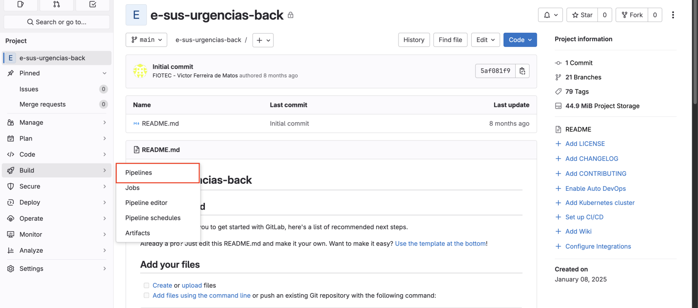
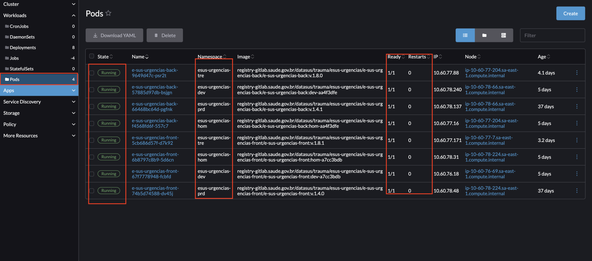
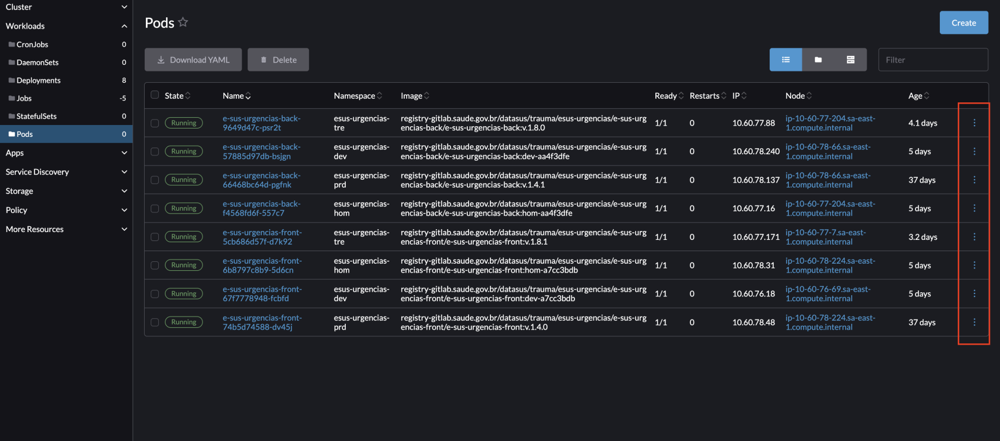
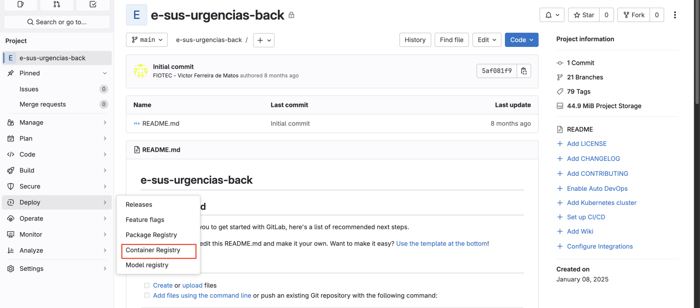

# Atualizar ambiente do E-SUS (DataSUS)

#### **Garanta que você tenha os seguintes acessos:**

 1. VPN FortiClient

 2. Acesso ao CITSmart: [https://demandasdatasus.saude.gov.br/](https://demandasdatasus.saude.gov.br/)

 3. Acesso ao Gitlab: [https://gitlab.saude.gov.br/](https://gitlab.saude.gov.br/)

  - Acesso ao repositório do Backend: [https://gitlab.saude.gov.br/datasus/trauma/esus-urgencias/e-sus-urgencias-back/](https://gitlab.saude.gov.br/datasus/trauma/esus-urgencias/e-sus-urgencias-back/)

  - Acesso ao repositório do Frontend: [https://gitlab.saude.gov.br/datasus/trauma/esus-urgencias/e-sus-urgencias-front](https://gitlab.saude.gov.br/datasus/trauma/esus-urgencias/e-sus-urgencias-front)

 4. Acesso ao Rancher: [https://console-prd.saude.gov.br/](https://console-prd.saude.gov.br/)

Em todo o processo você precisará **obrigatoriamente** estar com a VPN ligada. **Lembrando que, para ligar a VPN FortiClient, primeiro você terá que se desconectar da VPN Pritunl da empresa para evitar conflitos.**

Com isso em mente, os passos são:

### **Caso tenha Scripts SQLs novos**

Para realizar o deploy, vá ao Gitlab e clone o repositório (na branch **main**) do backend e do frontend. Note que nestes repositórios já existem alguns arquivos. **NÃO APAGUE ELES**. Eles são necessários para que você suba os ambientes corretamente.

Após clonar o repositório, para o backend copie todos os arquivos da pasta backend do repositório da DigitalSys no Github e cole. Lembre-se de retirar os arquivos que não são necessários (exemplo: /dist, /node\_modules, .env...).

Em seguida troque o nome da branch e realize o push para essa branch (atualmente o padrão de branch está sendo "feat/sprint-&lt;número da sprint&gt;"

```bash
git checkout -b &lt;nome-da-branch>
git add .
git commit -m "&lt;descrição>"
git push
```

Para executar os jobs de deploy você também deverá fazer o push incluindo a tag de cada ambiente.

As tags são as seguintes:

```markdown
- Desenvolvimento: dev-&lt;hash do commit>
- Staging: hom-&lt;hash do commit>
- Treinamento: v.&lt;versão>
- Produção: v.&lt;versão>
```

Exemplo de push para cada ambiente:

```bash
# Supondo que o hash do commit após o push é "123abc"
git tag dev-123abc 
git push origin dev-123abc

git tag hom-123abc
git push origin hom-123abc

git tag v.1.0.0
git push origin v.1.0.0
```

Pelo fato de Treinamento e Produção utilizar o mesmo tagueamento, ao realizar o push considerando o padrão "v.&lt;versão&gt;", você estará subindo ambos os ambientes ao mesmo tempo.

Por fim, ao realizar esses push's você deverá ir até o Gitlab e acompanhar o build. Caso o build complete sem erro você deve executar manualmente o deploy, conforme imagem abaixo:

[](https://ajuda.digitalsys.com.br/uploads/images/gallery/2025-10/scaled-1680-/CxKNNlUsG3azr6XI-captura-de-tela-2025-10-06-as-17-08-37.png)

[](https://ajuda.digitalsys.com.br/uploads/images/gallery/2025-10/scaled-1680-/mikIO1pWZGFHiMwX-captura-de-tela-2025-10-06-as-17-09-09.png)

Para acompanhar o processo de deploy, você deverá ir até o Rancher e verificar o processo de deploy. Esse processo é acompanhado em Workloads &gt; Pods

[](https://ajuda.digitalsys.com.br/uploads/images/gallery/2025-10/scaled-1680-/QW53IgLc9kegKjbN-captura-de-tela-2025-10-06-as-17-10-47.png)

Caso dê qualquer tipo de problema o ideal é que você cheque os logs, clicando no símbolo de "três pontinhos":

[](https://ajuda.digitalsys.com.br/uploads/images/gallery/2025-10/scaled-1680-/sS8t2DauybJAl3rT-captura-de-tela-2025-10-06-as-17-12-12.png)

**O processo é o mesmo para o frontend (lembre-se de copiar apenas as pastas necessárias).**

**OBSERVAÇÕES:**

\- Caso dê qualquer tipo de problema referente a falta de espaço em disco você precisará apagar imagens antigas do Container Registry, dentro do Gitlab.

[](https://ajuda.digitalsys.com.br/uploads/images/gallery/2025-10/scaled-1680-/PmeIJGm4ybDsTIFP-captura-de-tela-2025-10-06-as-17-13-39.png)

\- Se por qualquer outro motivo você encontrar algum erro fora do comum no processo de build, o contato de Infra é o victor.matos@saude.gov.br (Victor Ferreira de Matos)

- Se por ventura você precisar alterar alguma variável de ambiente, o mesmo deve ser feito no Rancher. As variáveis de ambiente do backend estão em "Secrets" e do frontend em "ConfigMaps". 

 O frontend está em ConfigMaps pois via Secrets não foi possível alterar as informações sem a necessidade de rebuildar.

[](https://ajuda.digitalsys.com.br/uploads/images/gallery/2025-10/scaled-1680-/l8Ogo8oQUFn3J9qR-captura-de-tela-2025-10-06-as-17-17-07.png)

### **Produção**

