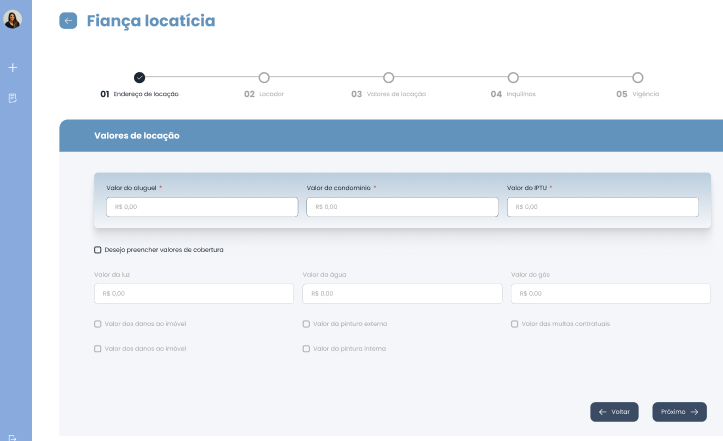

# Fluxo do Usuário - Figma

Link: [HSoares Seguros – Figma](https://www.figma.com/design/3uJTJUHe2FpbzoHuModYoS/HSoares-Seguros?node-id=2-27&p=f)

#### **Criar novas propostas**

Para que um usuário possa criar novas propostas ele deverá realizar seu login com as credenciais corretas para ter acesso a parte interna do sistema.

Após selecionar "Começar proposta" o usuário será redirecionado para a próxima página da criação de propostas, a qual somente ficará disponível após aceite do seguinte modal de Termo de Aceitação

Com esta primeira etapa preenchida, segue-se para os valores de locação, estes que se referem ao aluguel, condomínio, IPTU e demais coberturas como luz, água, gás, danos, pinturas e multas. Estes três últimos itens citados possuem seu valor padrão igual ao valor descrito no campo aluguel. Caso necessário a mudança poderá ser feita manualmente pelo usuário.

