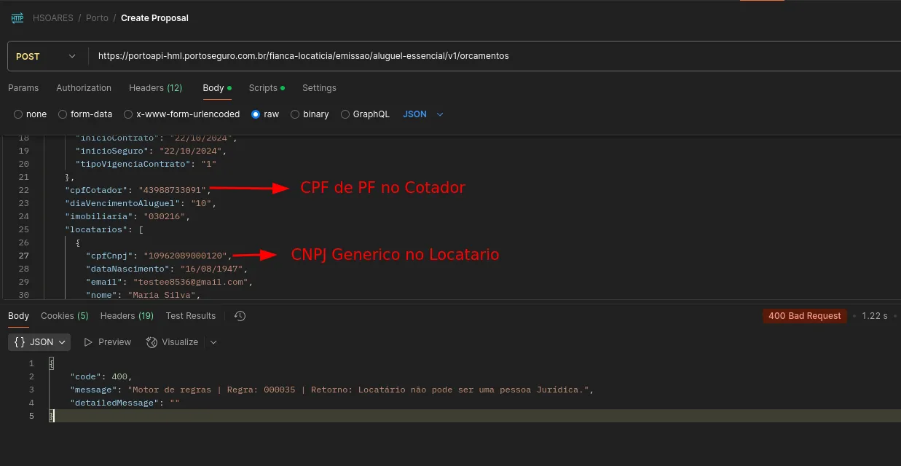
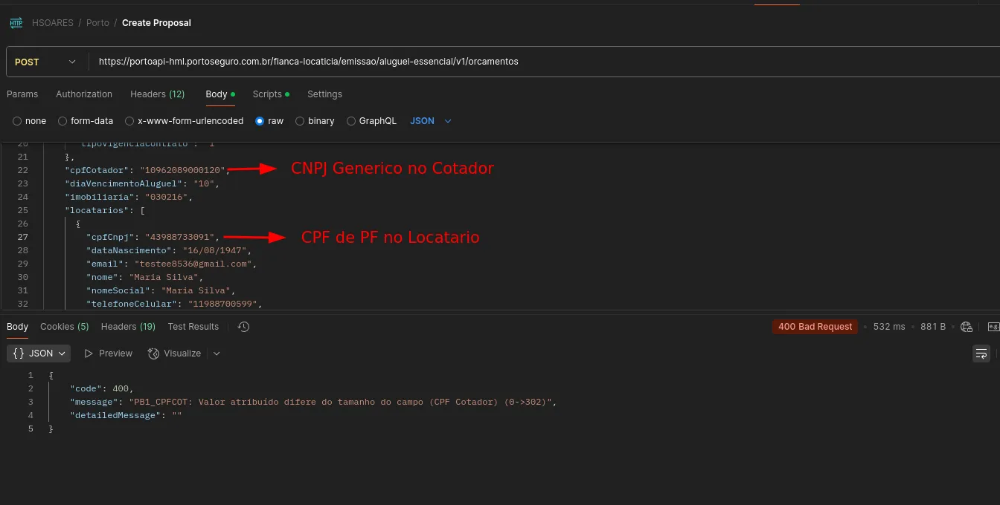
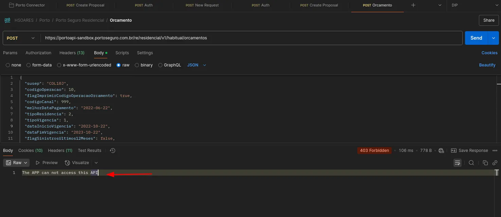
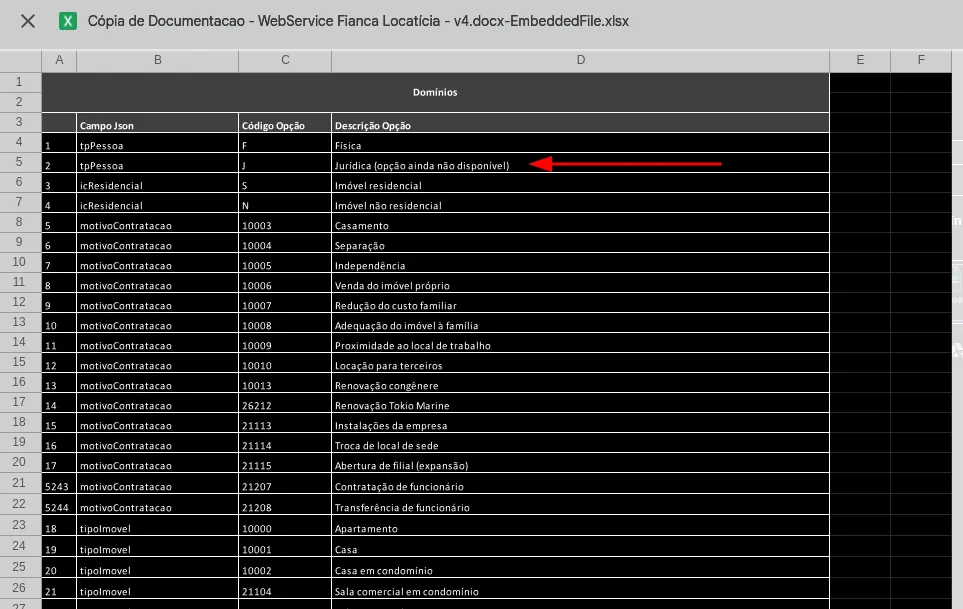
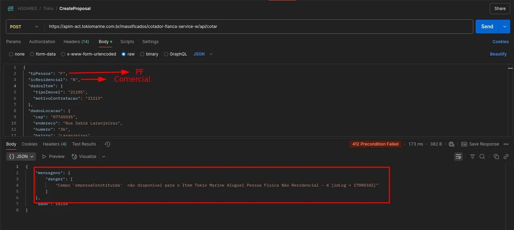

# Propostas PJ e Comerciais

# Seguro PJ

##### Overview inicial

- seguradoras nao estao contemplando o seguro pj
- organizar do nosso lado pra assim que isso estivar contemplado estiver organizado da nossa parte
- na tela de prosposta se o seguro for pj exibir os dados de pj
- contemplar os dois mundo pj e pf
- outras coisas a ter contempladas(outros seguros)
-  Funciona Comercial e Residencial PF
- Nao Comercial PJ

## Porto Seguros

##### Documentação

[https://dev.portoseguro.com.br/api-portal/content/apis-porto](https://dev.portoseguro.com.br/api-portal/content/apis-porto)

[https://dev.portoseguro.com.br/api-portal/content/aluguel-essencial-novo](https://dev.portoseguro.com.br/api-portal/content/aluguel-essencial-novo)

[https://dev.portoseguro.com.br/api-portal/swagger/fianca-locaticia-aluguel-essencial/1.0.0](https://dev.portoseguro.com.br/api-portal/swagger/fianca-locaticia-aluguel-essencial/1.0.0)

Ao tentar fazer um criar um orcamento de proposta para Pessoa Juridica no seguinte endpoint

`https://portoapi-hml.portoseguro.com.br/fianca-locaticia/emissao/aluguel-essencial/v1/orcamentos`

Ao tentar criar um orçamento com um CPNJ referenciando Pessoa Juridica, retorna 400

com a messagem que o locatario não pode ser uma pessoa Juridica

Na tentativa de inverter, enviar o CNPJ no campo do cotador e o CPF no campo do locatario, retorna 400, somente pode ser atribuido CPF para o cotador.

##### **Procurando outros produtos na Porto**

Acessando [https://dev.portoseguro.com.br/api-portal/content/apis-porto](https://dev.portoseguro.com.br/api-portal/content/apis-porto) e constatando que usamos o produto "Fiança Locaticia" que pelos teste nao é possivel utilizar dados de PJ, encontrei um produto parecido "Porto Seguro Residencial", que tem como publico alvo PF e PJ ([https://dev.portoseguro.com.br/api-portal/content/porto-seguro-residencial](https://dev.portoseguro.com.br/api-portal/content/porto-seguro-residencial)).

Apos fazer alguns testes no Postman com as credenciais (client id e client secret) e ler o seguinte trecho na documentaçao do "Porto Seguro Residencial" :

`1. Para obter o token, cada parceiro deve possuir suas próprias credenciais: **Client ID e Client Secret**. 2. Essas credenciais são geradas através da criação de uma APP no [Portal do Desenvolvedor](<https://dev.portoseguro.com.br/api-portal/myapps/new>). 3. A concessão de token a partir dessas credenciais só estará disponível após **aprovação da APP pela Porto Seguro**`

Cheguei a conclusao que nao temos acesso a esse produto pois nao foi marcado na hora de criar um novo app no portal de desenvoldor da porto

## Too Seguros

##### Documentação

[https://developers.tooseguros.com.br/documentacao/api-fianca-locaticia-regras-e-payloads-v2](https://developers.tooseguros.com.br/documentacao/api-fianca-locaticia-regras-e-payloads-v2)

Quando é criado uma proposta na too, criando como Comercial, cria sem problemas, porem não existe nenhum campo para informar se é do tipo PJ ou para informar o cnpj

Analisando a documentação notei que a diferenciaçao de propostas entre PF e PJ só ocorre no seguinte endpoint:

`https://openapi-uat.tooseguros.com.br/fianca/proposta/ficha/{NumeroProposta}`

Que seria o passo 7 da documentaçao, e atualmente não chegamos a integrar nos nossos Connectors, só vamos até passo 6, que seria consultar os metodos de pagamento.

## Tokio Marine

##### Documentaçao

[https://docs.google.com/document/d/1K2DdzeY3tl36hJFcraWDztLLLN0hgaaU/edit?tab=t.0](https://docs.google.com/document/d/1K2DdzeY3tl36hJFcraWDztLLLN0hgaaU/edit?tab=t.0)

Dada a documentação de fiança locaticia da tokio fiz uma serie de testes com passando pessoa juridica (residencial ou nao) na requisição, houve a tentativa de todos os codigos de tipo de imovel, e em todas as tentivas retornaram a mesma mensagem de erro

Analisando todas as opções dos campos na documentação foi descrito que a opção de pessoa Juridica para tpPessoa ainda não estava disponivel, o que condiz com os resultados dos testes no Postman

Como não consegui acesso a mais documentaçoes e um portal de desenvolvedor da Tokio para mais informações cheguei a conclusão de que no momento nao é possivel criar propostas para PJ.

#### PF + Comercial

Em requisições para propostas comerciais e pessoas fisicas a api retorna 412 pedindo o campo `empresaConstituida` no payload, porem na documentação fornecida não existe nenhum registro de onde seria definido nem quais valores este campo aceita.

## Conclusão

- **Porto Seguro:**
    - O produto atualmente utilizado ("Fiança Locatícia Aluguel Essencial") **não permite** orçamentos para Pessoa Jurídica, retornando erro ao tentar usar CNPJ para o locatário ou mesmo para o cotador.
    - Um produto alternativo ("Porto Seguro Residencial") foi identificado como tendo suporte a PF e PJ, mas **não está acessível** com as credenciais atuais, pois exigiria a criação de um novo APP no portal do desenvolvedor e a aprovação da Porto Seguro para esse produto específico.
- **Too Seguros:**
    - É possível criar propostas do tipo "Comercial", mas na etapa atual da integração (até o passo 6 - consulta de métodos de pagamento), **não há campos para informar dados de PJ** (como CNPJ).
    - A documentação sugere que a diferenciação entre PF e PJ ocorreria apenas em um passo posterior (passo 7 - `ficha/{NumeroProposta}`), que **ainda não foi integrado**.
- **Tokio Marine:**
    - **Não é possível criar propostas para PJ** no momento. Testes com dados de pessoa jurídica resultaram em erro.
    - A documentação do campo `tpPessoa` confirma que a opção para Pessoa Jurídica "ainda não estava disponível".
    - Um problema adicional foi identificado para propostas PF + Comercial, onde a API solicita um campo (`empresaConstituida`) que não está presente na documentação fornecida.